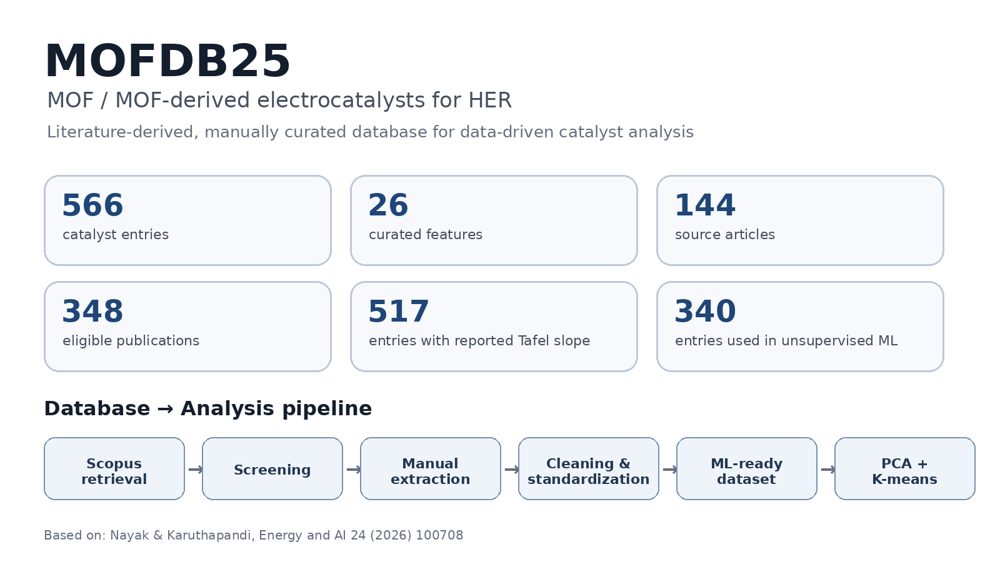
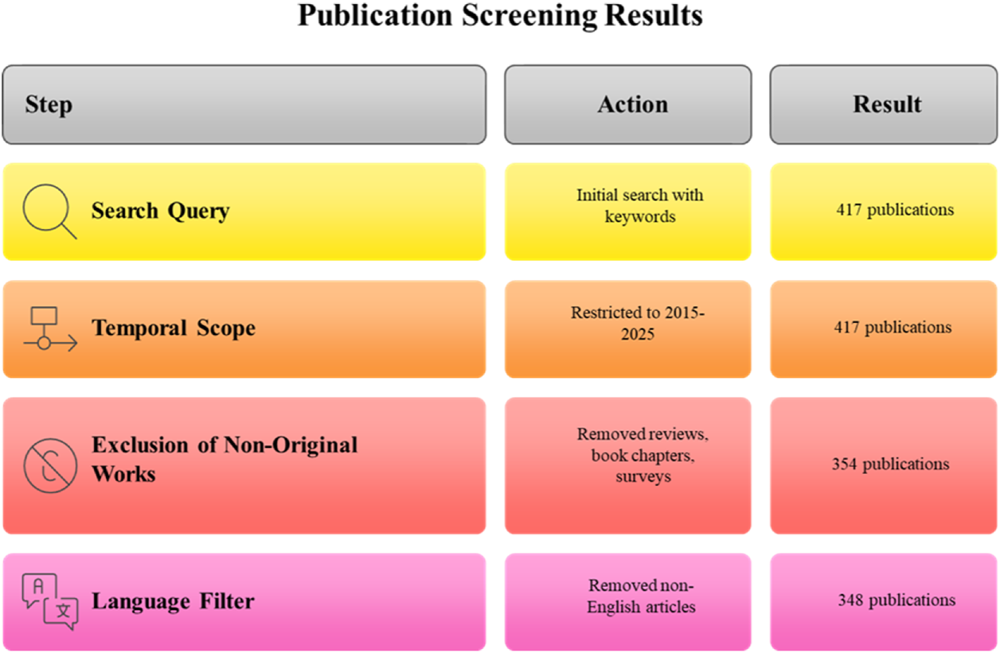
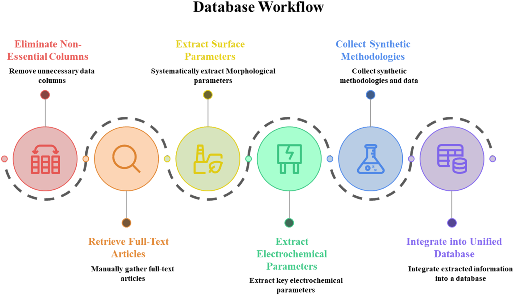
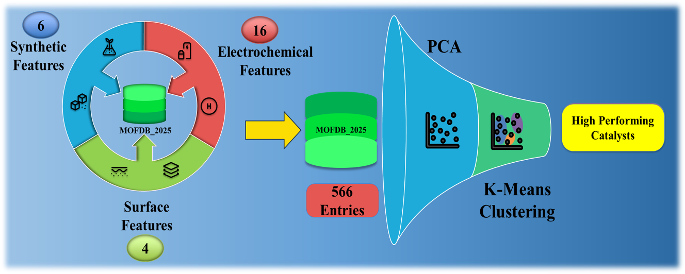

# MOFDB25 — MOF/MOF-Derived HER Electrocatalyst Database

<p align="center">
  
</p>

<p align="center">
  <b>A manually curated, literature-derived database of MOF and MOF-derived electrocatalysts for the hydrogen evolution reaction (HER)</b>
</p>

<p align="center">
  
  
  
  
</p>

---

## Citation

If you use MOFDB25, please cite the associated publication:

> **S. Nayak and S. Karuthapandi**, “Discerning the underlying trends in electrocatalytic hydrogen evolution activity of MOF/MOF-derived materials using data-driven approach,” *Energy and AI*, **24** (2026) 100708.  
> DOI: **10.1016/j.egyai.2026.100708**

### BibTeX

```bibtex
@article{Nayak2026MOFDB25,
  title   = {Discerning the underlying trends in electrocatalytic hydrogen evolution activity of MOF/MOF-derived materials using data-driven approach},
  author  = {Nayak, Sachidananda and Karuthapandi, Selvakumar},
  journal = {Energy and AI},
  volume  = {24},
  pages   = {100708},
  year    = {2026},
  doi     = {10.1016/j.egyai.2026.100708}
}
```
---

## Overview

**MOFDB25** is a manually curated literature-derived database developed for the systematic analysis of **MOF and MOF-derived electrocatalysts for the hydrogen evolution reaction (HER)**.

The database was constructed by systematically screening the SCOPUS literature, retrieving eligible research articles, manually extracting catalyst information from full-text articles and supplementary materials, and integrating structural, morphological, synthetic, and electrochemical descriptors into a unified dataset.

The associated study used statistical analysis and machine-learning approaches to investigate HER performance, mechanistic classification, catalyst grouping, and benchmarking against Pt/C.

> **Database status:** The present repository is intended to provide a reproducible home for the MOFDB25 dataset, documentation, and analysis resources.

---

## Key Statistics

| Parameter | MOFDB25 |
|---|---:|
| Catalyst entries | **566** |
| Curated features | **26** |
| Eligible publications after screening | **348** |
| Publications contributing catalyst entries | **144** |
| Entries after removal of missing Tafel-slope values | **517** |
| Entries used for subsequent unsupervised ML analysis | **340** |
| Promising entries identified through iterative clustering | **62** |
| High-performing entries identified against Pt/C benchmark | **10** |

The 26 features comprise **16 electrochemical**, **4 morphological**, and **6 synthetic** descriptors.

---

## Feature Categories

### 1. Electrochemical features — 16

- Current Density
- Overpotential (OP)
- Tafel Slope (TS)
- Kinetics Mechanism
- Exchange Current Density (ECD)
- Onset Potential
- Electrochemical Medium
- Acidic/Alkaline classification
- Encoded Medium
- Charge Transfer Resistance (Rct)
- Solution Resistance (Rs)
- Double-Layer Capacitance (Cdl)
- Electrochemical Surface Area (ECSA)
- Additives
- Nafion
- Mass Loading

### 2. Morphological / surface features — 4

- BET Surface Area
- Pore Size
- Pore Volume
- Graphitization Index (ID/IG)

### 3. Synthetic / compositional features — 6

- Synthesis Method
- Precursor Reagents
- Precursor Solvents
- MOF Used
- MOF Metal
- TM-O/S/N/C/P/Cl-related descriptor

---

### Publication screening workflow

<p align="center">
  
</p>

---

## Database Construction

The database integrates information from three major descriptor groups:

**Synthetic descriptors → Surface/morphological descriptors → Electrochemical descriptors**

The information was manually extracted from research articles and supplementary materials and subsequently cleaned, standardized, reviewed, and integrated into a unified database.

<p align="center">
  
</p>

---

## Machine-Learning Framework

MOFDB25 was designed to support both statistical and machine-learning analysis.

### Supervised learning

The study evaluated:

- Decision Tree (DT)
- Support Vector Machine (SVM)
- Naive Bayes (NB)

These models were used for classification of:

- HER mechanistic categories
- Low- vs high-overpotential categories
- Overall catalyst performance categories

### Semi-supervised analysis

- Principal Component Analysis (PCA)
- Structural classification using 0D, 1D, 2D and 3D categories

### Unsupervised learning

- PCA for dimensionality reduction and feature interpretation
- K-Means clustering for catalyst grouping and performance-oriented filtering

The K-Means analysis identified a **62-entry cluster** characterized by comparatively favorable OP and TS values. A subsequent clustering analysis was performed on these entries to further identify high-performing catalyst groups.

---

## Graphical Abstract

The original study summarizes the database and data-driven workflow as follows:

<p align="center">
  
</p>

---

## Citation

If you use MOFDB25, please cite the associated publication:

> **S. Nayak and S. Karuthapandi**, “Discerning the underlying trends in electrocatalytic hydrogen evolution activity of MOF/MOF-derived materials using data-driven approach,” *Energy and AI*, **24** (2026) 100708.  
> DOI: **10.1016/j.egyai.2026.100708**

### BibTeX

```bibtex
@article{Nayak2026MOFDB25,
  title   = {Discerning the underlying trends in electrocatalytic hydrogen evolution activity of MOF/MOF-derived materials using data-driven approach},
  author  = {Nayak, Sachidananda and Karuthapandi, Selvakumar},
  journal = {Energy and AI},
  volume  = {24},
  pages   = {100708},
  year    = {2026},
  doi     = {10.1016/j.egyai.2026.100708}
}
```

## Authors

**Sachidananda Nayak**  
Department of Chemistry, School of Advanced Sciences  
VIT-AP University, Amaravati, Andhra Pradesh, India

Author: `sachidanandanitr@gmail.com`

**Selvakumar Karuthapandi**  
Department of Chemistry, School of Advanced Sciences  
VIT-AP University, Amaravati, Andhra Pradesh, India

Corresponding author: `selvakumar.k@vitap.ac.in`

---

## License and Reuse

The associated article is published under a **CC BY-NC-ND** license.

The license of the **database files released in this repository should be explicitly specified by the repository authors**. Do not assume that the article's license automatically defines the license of newly released dataset files.

For article-derived figures included in this repository, retain the original attribution and licensing information.

---

## Disclaimer

MOFDB25 is a literature-derived research database. Reported experimental values reflect the conditions and characterization methods used by the original authors. Differences in electrolyte, reference electrode, catalyst loading, substrate, measurement protocol, iR correction, scan rate, and other experimental conditions can affect apparent HER performance.

The database should therefore be used as a **research and data-analysis resource**, not as a direct replacement for experimental validation.

---
---

<p align="center">
  <b>MOFDB25</b><br>
  Data-driven exploration of MOF/MOF-derived electrocatalysts for hydrogen evolution
</p>
